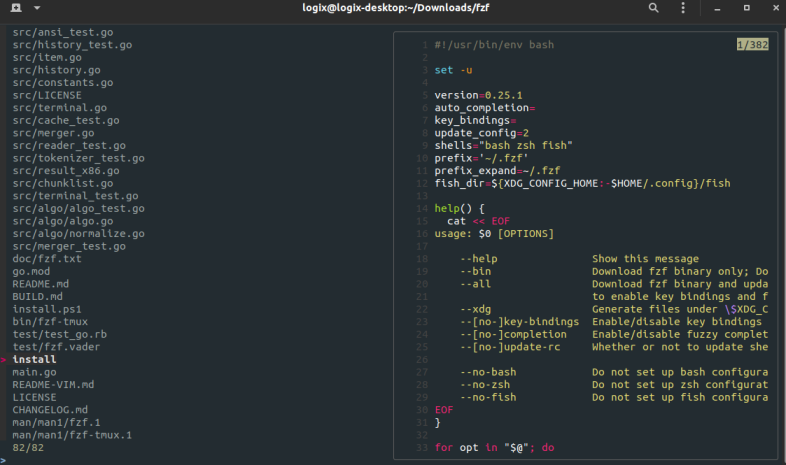

<table align="center"><tr><td>
<h1 align="center">
<a target="_self" href="https://github.com/z-shell/zi/">
  <p>
  
  </a>
  ❮ Zi package - fzf ❯
  </p>
  </h1>
  <h2 align="center"><p> A command-line fuzzy finder </p></h2>
<h3 align="center">
<table>
    <tr>
        <td><b>Package source:</b></td>
        <td>Source Tarball</td>
        <td>Binary</td>
        <td>Git</td>
        <td>Node</td>
        <td>Gem</td>
    </tr>
    <tr>
        <td><b>Status:</b></td>
        <td>✔️ (default)</td>
        <td>✔️</td>
        <td>✔️</td>
        <td>❌</td>
        <td>❌</td>
    </tr>
</table></h3>
<p><p>
</td></tr></table><hr />

## 💡 Wiki: [packages](https://wiki.zshell.dev/ecosystem/category/-packages) | [annexes](https://wiki.zshell.dev/ecosystem/category/-annexes)

## Available `pack''` invocations

```zsh
# Download the package with the default ice list
zi pack for fzf
```

```zsh
# Download the package with the default ice list + setting up the key bindings
zi pack"default+keys" for fzf
```

```zsh
# Download the package with the bin-gem-node annex-utilizing ice list
zi pack"bgn" for fzf
```

```zsh
# Download the package with the bin-gem-node annex-utilizing ice list
# + setting up the key bindings. The "+keys" variants are available for each profile
zi pack"bgn+keys" for fzf
```

```zsh
# Download with the bin-gem-node annex-utilizing ice list FROM GIT REPOSITORY
zi pack"bgn" git for fzf
```

```zsh
# Download the binary from the Github releases (like from'gh-r' ice)
zi pack"binary" for fzf
```

```zsh
# Download the binary from the Github releases and install via Bin-Gem-Node shims
zi pack"bgn-binary" for fzf
```

## Default Profile

Provides the fuzzy finder via Makefile-installation of the `fzf` binary under `$ZPFX/bin`.

```zsh
zi lucid as=program pick="$ZPFX/bin/(fzf|fzf-tmux)" \
  atclone="cp shell/completion.zsh _fzf_completion; cp bin/fzf-tmux $ZPFX/bin" \
    make="PREFIX=$ZPFX install" \
    …
```

## `bin-gem-node` Profile

Provides the fuzzy finder via _shims_, i.e.: automatic forwarder scripts created under `$ZPFX/bin` (which is added to the `$PATH` by default). It needs the [bin-gem-node](https://github.com/z-shell/z-a-bin-gem-node) annex.

```zsh
zi lucid as=null make \
  atclone="cp shell/completion.zsh _fzf_completion" \
  sbin="fzf;bin/fzf-tmux" \
  …
```

---

> This repository compatible with [Zi](https://github.com/z-shell/zi)

The [junegunn/fzf](https://github.com/junegunn/fzf) zsh package that uses the [zsh-string-lib](https://github.com/z-shell/zsh-string-lib) to automatically:

- get the plugin's Git repository OR release-package URL,
- get the list of the recommended ices for the plugin,
  - there can be multiple lists of ices,
  - the ice lists are stored in _profiles_; there's at least one profile, _default_,
  - the ices can be selectively overridden.
