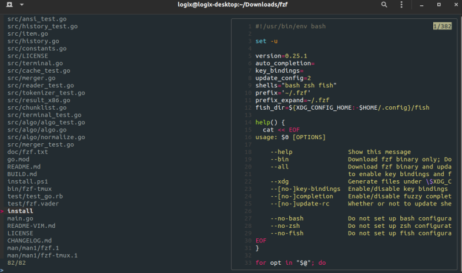

<div align="center" width="100%"><table><tr><td>
  <h1><a target="_self" href="https://github.com/z-shell/zi/">
    </a>
    ❮ ZI ❯ Package - fzf </h1>
<h2 align="center">

| **Package source:** |        Source Tarball        |       Binary       |        Git         | Node | Gem |
| :-----------------: | :--------------------------: | :----------------: | :----------------: | :--: | :-: |
|     **Status:**     | :heavy_check_mark: (default) | :heavy_check_mark: | :heavy_check_mark: | :x:  | :x: |

</h2>
  <h3 align="center">
  <p> A command-line fuzzy finder
  <p><p>
  </h3>
</td></tr></table></div><hr />

### Available `pack''` invocations

```zsh
# Download the package with the default ice list
zi pack for fzf
```

```zsh
# Download the package with the default ice list + setting up the key bindings
zi pack"default+keys" for fzf
```

```zsh
# Download the package with the bin-gem-node annex-utilizing ice list
zi pack"bgn" for fzf
```

```zsh
# Download the package with the bin-gem-node annex-utilizing ice list
# + setting up the key bindings. The "+keys" variants are available for each profile
zi pack"bgn+keys" for fzf
```

```zsh
# Download with the bin-gem-node annex-utilizing ice list FROM GIT REPOSITORY
zi pack"bgn" git for fzf
```

```zsh
# Download the binary from the Github releases (like from'gh-r' ice)
zi pack"binary" for fzf
```

```zsh
# Download the binary from the Github releases and install via Bin-Gem-Node shims
zi pack"bgn-binary" for fzf
```

## Default Profile

Provides the fuzzy finder via Makefile-installation of the `fzf` binary under `$ZPFX/bin`.

```zsh
zi lucid as=program pick="$ZPFX/bin/(fzf|fzf-tmux)" \
  atclone="cp shell/completion.zsh _fzf_completion; cp bin/fzf-tmux $ZPFX/bin" \
    make="PREFIX=$ZPFX install" \
    …
```

### `Bin-Gem-Node` Profile

Provides the fuzzy finder via _shims_, i.e.: automatic forwarder scripts created under `$ZPFX/bin` (which is added to the `$PATH` by default). It needs the [bin-gem-node](https://github.com/z-shell/z-a-bin-gem-node) annex.

```zsh
zi lucid as=null make \
  atclone="cp shell/completion.zsh _fzf_completion" \
  sbin="fzf;bin/fzf-tmux" \
  …
```

---

> This repository compatible with [ZI](https://github.com/z-shell/zi)

The [junegunn/fzf](https://github.com/junegunn/fzf) zsh package that uses a [string library](https://github.com/z-shell/zsh-string-lib) for Zsh which will:

- get the plugin's Git repository OR release-package URL,
- get the list of the recommended ices for the plugin,
  - there can be multiple lists of ices,
  - the ice lists are stored in _profiles_; there's at least one profile, _default_,
  - the ices can be selectively overridden.
